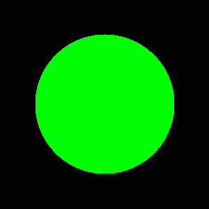
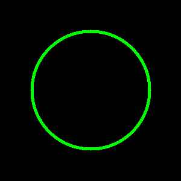
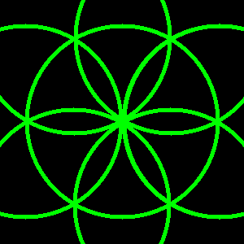
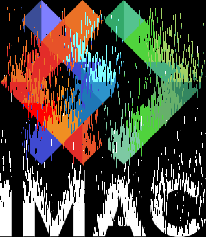
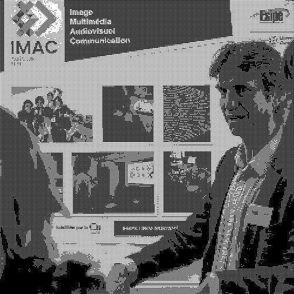
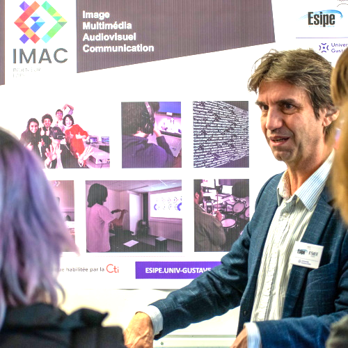
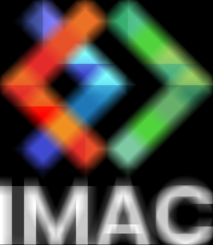

# 🐣 S1 | Prog : Workshop Alexandre Bonnet

Bienvenue dans mon dossier de rendu du worshop de **traitement d’images** en C++.  
Les images se trouvent dans le dossier output `output/`.

---

## keep_green_only

---

## channels_swap

---

## NoirEtBlanc

---

## negative

---

## degrade

---

## mirroir

---

## rotate

---

## disk

---

## circle

---

## lighten

---

## darken

---

## rosace

---

## mosaic

---

## sort

---

## dithering

---

## normalise

---

## convolution

